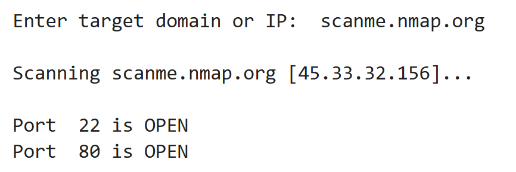

# Assignment 19: Python Socket Port Scanner

## Objective
Build a simple 15-line Python script that scans TCP ports 1–100 on a target host using raw sockets. Compare its capabilities to professional tools like `nmap` to understand both the “how” and the “why” behind port-scanning.

## Methodology
1. **Input & Resolution**  
   - Prompt the user for a domain or IP address.  
   - Use `socket.gethostbyname()` to resolve a hostname to its IP.
2. **Port Loop**  
   - Iterate TCP ports from 1 to 100.  
   - For each port:
     - Create a socket with a small timeout (e.g. 0.5 s).
     - Attempt to connect.
     - If successful, record the port as open.
     - Close the socket.
     - Sleep briefly (e.g. 0.1 s) to avoid rapid-fire scanning.
3. **Output Formatting**  
   - Print only the open ports in a clean, user-friendly list.
4. **Comparison**  
   - Note that raw sockets teach the basics of TCP handshakes.
   - Contrast with `nmap`’s features: parallel scanning, UDP checks, service/version detection, stealth modes.

## Findings
- **Simplicity Underneath Complexity**  
  Even advanced scanners rely on the same low-level connect attempts; the real innovation is in performance, stealth, and protocol coverage.
- **Open ≠ Safe**  
  Discovering an open port is only the first step—further analysis is needed to identify running services and vulnerabilities.
- **Ethical Considerations**  
  Adding delays and timeouts respects target stability and reduces chance of accidental DoS or detection.
- **Learning TCP/IP**  
  Direct use of sockets makes the TCP three-way handshake and connection logic tangible.
- **Scope Limitations**  
  Our script scans only TCP ports 1–100; tools like `nmap` cover UDP, full port ranges, fingerprinting, scripts, and evasion techniques.

## Conclusions
- It’s entirely possible to build a functional port scanner from scratch in just 15 lines of Python.
- Hands-on socket programming deepens understanding of TCP/IP mechanics.
- Responsible scanning (timeouts, sleeps) is critical for ethical hacking.
- Well-formatted output enhances usability.
- Moving from basics to tools like `nmap` shows how scale, parallelism, and protocol support expand capability.

## Code (`port_scanner.py`)
Access the code [here](code.py)
```
python
import socket, time

target = input("Enter domain or IP: ")
ip = socket.gethostbyname(target)
print(f"Scanning {ip} (ports 1–100)…\n")

for port in range(1, 101):
    sock = socket.socket(socket.AF_INET, socket.SOCK_STREAM)
    sock.settimeout(0.5)
    result = sock.connect_ex((ip, port))
    if result == 0:
        print(f"Port {port:03d} is OPEN")
    sock.close()
    time.sleep(0.1)

```

## Output


